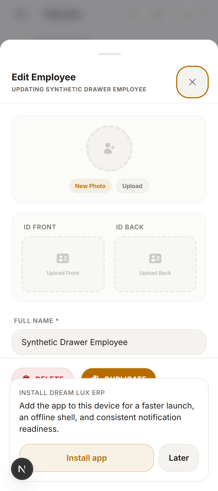
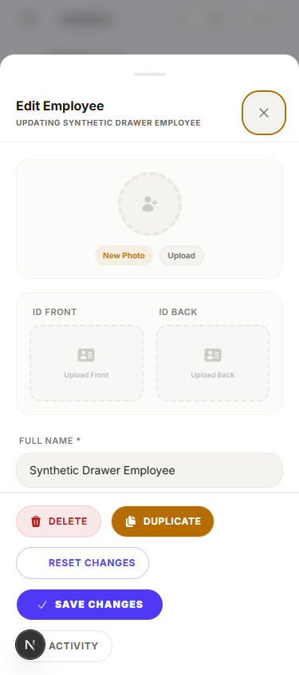
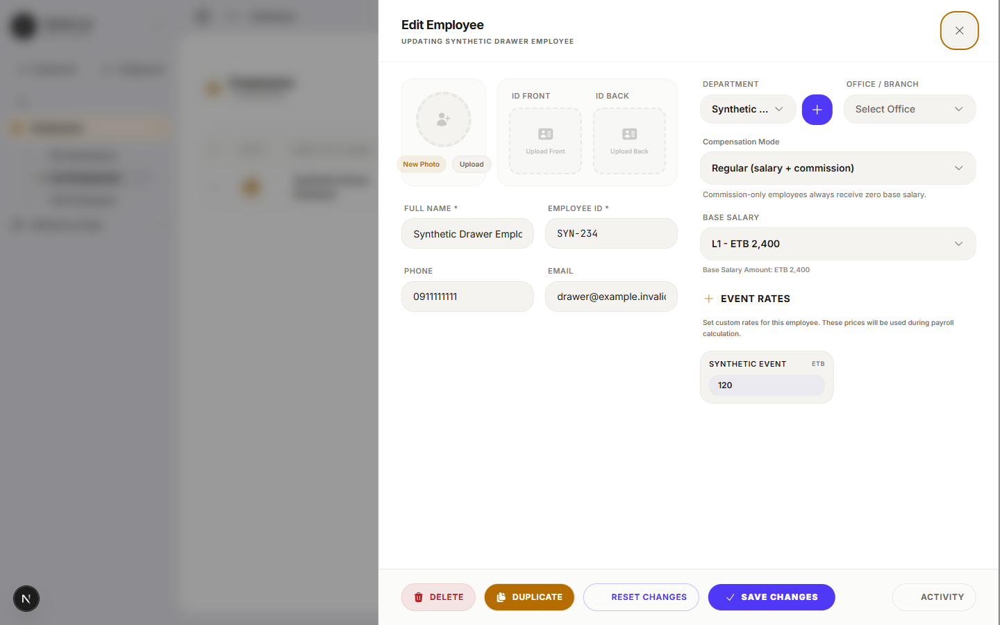
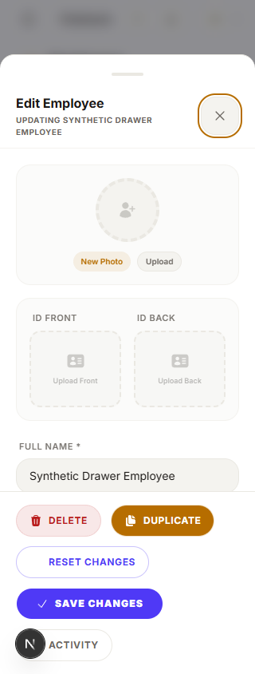

# Release safeguard evidence

These images use only synthetic records in the isolated DreamLux employee-editor
fixture. They are **not production screenshots** and do not certify a production
save or database migration.

The previous install prompt rendered at layer 75 above the editor's layer 50.
The correction places it at layer 40. The focused browser check verifies the
rendered layers, a reachable Save action without submitting it, Activity
open/Escape, parent Escape, prompt dismissal and zero writes.

| Before: 375px | After: 375px |
| --- | --- |
|  |  |

Desktop and narrow mobile controls

The predecessor failed the layer assertion at both 1440px and 375px
(`75 < 50` was false). The corrected focused case passed at 1440px, 375px and
320px. The PWA component file passed six targeted tests, including user-initiated
installation and dismissal. The backend startup guard runs the real app
initialization in a fresh process with mocked database/provider clients; it
preserves the permission listener, read-only health check and unauthenticated
session denial without running legacy DDL.

No whole-suite, native database or CI campaign was run for these changes.
Production target/catalog verification and deployment remain separate gates.
